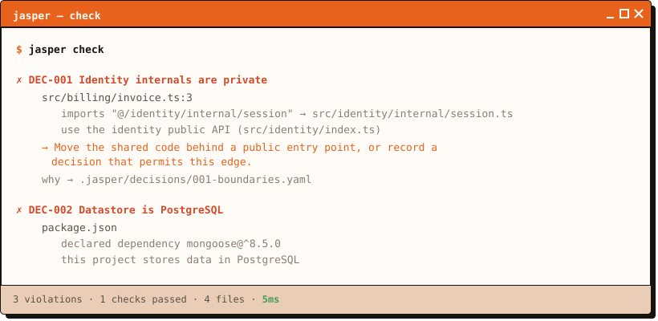
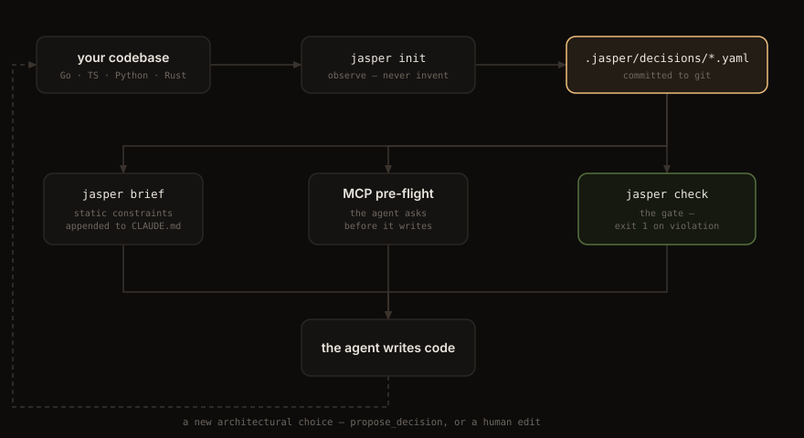

<div align="center">

<picture>
  <source media="(prefers-color-scheme: dark)" srcset="assets/logo-dark.svg">
  
</picture>

# Jasper

**Your coding agent makes architectural decisions every hour.**<br>
**Jasper records them, and tells the agent — or the build — when the code stops honoring them.**


[](https://go.dev/dl/)
[](docs/checks.md)
[](docs/languages.md)
[](docs/mcp.md)
[](go.mod)

[**Website**](https://jasper-toolbox.vercel.app/) · [**Install**](#install) · [**Quickstart**](#quickstart) · [**Checks**](docs/checks.md) ·
[**MCP**](docs/mcp.md) · [**Architecture**](docs/architecture.md) · [**All docs**](docs/)

</div>

<br>

<p align="center">
  
</p>

Jasper is not a spec generator and not a workflow engine. It sits *underneath*
Claude Code, Cursor or Codex and does one thing: turns architectural decisions
into checks that run on every commit, and answers an agent's questions while
it is still deciding.

---

## Why this exists

Generating an architecture document is the easy half, and it is already free.
The hard half is that six weeks later the code no longer matches it — and a
stale architecture doc is worse than none, because agents read documentation as
ground truth and generate code to fit an architecture that no longer exists.

The compiler and the test suite do not help here. This import:

```ts
import { getSession } from '@/identity/internal/session'
```

type-checks, compiles, runs, and passes every test. Nothing is mechanically
wrong with it. It is wrong only because `identity` owns its storage format and
`billing` just took a dependency on it — so in six weeks a local change becomes
a breaking one. Three different tools answer three different questions:

| Tool | Question |
|------|----------|
| compiler | is this valid? |
| tests | does this work? |
| **Jasper** | **is this what we agreed?** |

Architectural drift is, by definition, the code that compiles and passes.

## The shape of a decision

A decision is one YAML file with three audiences:

| Part | Audience | Purpose |
|------|----------|---------|
| `why` | the human reading it in six months | rationale, alternatives, the failure it prevents |
| `brief` | the coding agent, before it starts | ~60 tokens of constraint |
| `enforce` | CI and the agent's pre-flight | checks that exit non-zero |

A decision with no `enforce` block is a note, not a rule, and Jasper renders it
as one.

```yaml
id: DEC-002
title: Datastore is PostgreSQL
status: accepted          # accepted | proposed | superseded
origin: observed          # observed | proposed | authored
date: 2026-09-16

why: |
  Billing needs transactions across rows. A second datastore arriving quietly
  splits transactions, backups and on-call knowledge before anyone reviews it.

brief: |
  Persistence is PostgreSQL. The pg driver stays behind src/db/**.
  Another datastore requires superseding this decision.

enforce:
  - forbid_dependency:
      packages: [mongodb, mongoose, mysql2]
      message: "this project stores data in PostgreSQL"
  - confine:
      package: pg
      to: "src/db/**"

affects: [billing, db]
```

Decisions live in `.jasper/decisions/*.yaml`, committed to git. Git already
provides versioning, diffing, branching and review, so Jasper builds none of
those.

---

## Install

The module is not published yet, so `go install ...@latest` will not resolve.
From a clone:

```sh
git clone https://github.com/rohan-murmu/jasper.git && cd jasper
go install ./cmd/jasper          # -> $(go env GOPATH)/bin/jasper
jasper version
```

Requires Go 1.24+ to build. The result is a single static binary: no CGO, no
Node, no Python runtime, and exactly one Go dependency (`gopkg.in/yaml.v3`).

## Quickstart

```sh
cd your-project
jasper init          # observe the repo; propose only rules that already pass
jasper check         # verify — exit 1 on violation
jasper brief         # what an agent should know before it starts
```

`jasper init` never invents an architecture. It parses imports, lockfiles and
manifests, reports what is *actually* true, and proposes only rules that pass
on your current HEAD — so the first run is never a wall of failures. Facts that
do **not** hold are shown and deliberately not offered:

```
  What is true of your code right now
    ✓ 5 direct dependencies declared  fastapi, httpx, psycopg, requests, sqlalchemy
    ✓ Datastore: PostgreSQL  no other database driver is declared
    ✗ Two Python HTTP clients: httpx and requests  one of these is probably drift — pick one before enforcing
```

---

## Checks

Ten primitives. Each is one file in `internal/engine/checks/`.

| Kind | Catches | Reads |
|------|---------|-------|
| `no_import` | a specific forbidden edge between two globs | imports |
| `layers` | a whole dependency direction, plus peer isolation, in one rule | imports |
| `public_api` | anything reaching past a module's entry point | imports |
| `no_cycles` | circular dependencies between directories | imports |
| `confine` | a driver or library escaping the layer that owns it | imports |
| `require_import` | a file that *fails* to import something mandatory | imports |
| `forbid_dependency` | a technology choice being quietly reversed | manifest + imports |
| `approved_dependencies` | **any** package added without a decision | manifest |
| `max_dependencies` | a dependency budget being exceeded | manifest |
| `forbid_text` | a pattern in source: `process.env` outside config, debug logging in prod | file text |

Two notes that have bitten people:

- `except` in `no_import` and `public_api` exempts **importers**, never targets.
  Exempting a target would let one broad exception silently cancel the rule it
  sits inside.
- `layers` expresses direction and peer isolation. It cannot express a
  constraint that is not about direction — "the engine must not import the
  scanner because the engine must stay pure" is a property, not an ordering.
  Those stay explicit `no_import` rules.

Full reference with examples for every field: **[docs/checks.md](docs/checks.md)**.

## Languages

| Language | Files | Imports via | Manifests | Resolution |
|----------|-------|-------------|-----------|------------|
| Go | `.go` | `go/parser` (stdlib, exact) | `go.mod` | module path → package directory |
| TypeScript / JavaScript | `.ts .tsx .mts .cts .js .jsx .mjs .cjs` | hand-written tokenizer | `package.json` | relative paths + `tsconfig` path aliases |
| Python | `.py .pyi` | comment/string blanking + statement match | `requirements.txt`, `pyproject.toml`, `Pipfile` | dotted paths, relative imports, `src/` layout |
| Rust | `.rs` | comment/string blanking + `use` match | `Cargo.toml` | `crate::`/`self::`/`super::`, longest existing prefix |

Adding a language is one new package and one blank import — no existing file
changes. Per-language behaviour, known limitations, and a worked example of
adding Java: **[docs/languages.md](docs/languages.md)**.

---

## Wiring it to your agent

<p align="center">
  
</p>

Two ways in, catching drift at very different moments. Each arrow above is a
separate command, and none of them runs in the background — Jasper is a gate you
position, not a guard that patrols.

### MCP — the agent asks before it writes

```sh
claude mcp add jasper -- jasper mcp
```

Or commit a `.mcp.json` so the whole team gets it:

```json
{
  "mcpServers": {
    "jasper": { "command": "jasper", "args": ["mcp"] }
  }
}
```

Seven tools. The pre-flight pair is the point:

| Tool | When the agent calls it |
|------|-------------------------|
| `architecture_brief` | before starting work in an unfamiliar area |
| `can_import` | before writing an import that crosses a boundary |
| `can_add_dependency` | before adding any package |
| `check_architecture` | after a batch of edits, before claiming it is done |
| `explain_decision` | when a denial needs context |
| `list_decisions` | to see what exists |
| `propose_decision` | to put an alternative in front of a human |

`can_import` and `can_add_dependency` answer for code that **does not exist
yet** — the importing file need not be on disk:

```
can_import(from="src/billing/tax.ts", spec="pg")

DENIED — import of "pg" by src/billing/tax.ts would violate a recorded decision.
"pg" is an external package (pg)

DEC-002 Datastore is PostgreSQL
  the database driver stays behind the db layer
  fix: Access it through the layer at src/db/** instead of importing it directly.
  rationale: .jasper/decisions/002-datastore.yaml (explain_decision id=DEC-002)
```

A verdict reports only what the change would **introduce**. A repo with
existing violations does not answer DENIED to every question — otherwise the
agent learns the tool is noise and stops calling it.

`propose_decision` writes `status: proposed`, which **enforces nothing**: the
engine skips any decision that is not accepted, so an agent can argue for a
rule change in git but cannot approve itself out of a constraint. Flipping it
to `accepted` is a human edit, in a diff, in review.

Setup, tool schemas, and how to prompt an agent to use them:
**[docs/mcp.md](docs/mcp.md)**.

### CLI — the gate that holds

MCP is advisory; an agent can decline to call a tool. Keep a gate that does not
depend on cooperation.

```sh
# CI — annotations land inline on the PR diff
jasper check --format github

# pre-commit
echo 'jasper check' >> .git/hooks/pre-commit && chmod +x .git/hooks/pre-commit
```

For an agent with no MCP support, the static fallback still works:

```sh
jasper brief >> CLAUDE.md
```

---

## CLI reference

| Command | Does | Needs `.jasper` | Exit |
|---------|------|-----------------|------|
| `jasper init` | observe the repo, propose enforceable decisions | creates it | 0 |
| `jasper check` | verify code against every accepted decision | **yes** | 0 ok / 1 violations |
| `jasper ls` | list decisions | no | 0 |
| `jasper why <DEC-id>` | rationale, brief, rules, source file | no | 0 / 1 not found |
| `jasper brief` | markdown constraints for an agent | no | 0 |
| `jasper mcp` | run as an MCP server on stdio | no | 0 |
| `jasper checks` | list available check kinds | no | 0 |
| `jasper version` · `jasper help` | — | no | 0 |

```
-C <dir>          run as if started in <dir>
--format <fmt>    check: text (default) | json | github     (also --format=json)
--yes             init: accept every proposal without asking
```

Exit codes: **0** success, **1** your code is wrong, **2** you invoked it wrong
(usage error, missing `.jasper`, malformed decision file). CI cares about the
1-vs-2 distinction.

## Architecture

Jasper is a pure function with a thin impure shell:

```
(repo bytes, .jasper/ files) → Snapshot → []Finding
```

```
  ports/      cli · mcp · (lsp)        zero business logic
  service/    Check Init Brief         orchestration + composition root
  engine/     pure, parallel           checks
  facts/      pure                     observations for init
  scan/       bytes → Snapshot         store/  yaml → Decisions
  model/      zero dependencies        glob/   path dialect
```

`scan` is the only package that reads source files. Everything above it is a
function of the `Snapshot` it produces, which is what lets the same engine run
in a CLI, an MCP server, a CI job and a batch over hundreds of repos without
modification.

Four extension seams, and only four: **Language**, **Check**, **Port**,
**Provider**. Jasper enforces its own layering — see
`.jasper/decisions/002-layering.yaml`.

Full walkthrough with diagrams: **[docs/architecture.md](docs/architecture.md)**.

## Documentation

| Doc | Covers |
|-----|--------|
| [docs/architecture.md](docs/architecture.md) | layers, seams, the purity boundary, data flow |
| [docs/workflows.md](docs/workflows.md) | `init` / `check` / MCP lifecycles, end to end |
| [docs/checks.md](docs/checks.md) | every check, every field, worked examples |
| [docs/languages.md](docs/languages.md) | per-language support, resolution rules, limits |
| [docs/mcp.md](docs/mcp.md) | MCP setup, tool reference, agent prompting |
| [docs/scaling.md](docs/scaling.md) | monorepos, large repos, performance, adoption |
| [docs/contributing.md](docs/contributing.md) | adding a check, a language, or a port |

## Status

v1, early, and honest about it.

**Works today.** Ten checks. Four languages. CLI and MCP ports. Self-enforcing
(`jasper check` on this repo passes 9 compiled checks). 48 files, ~5.5k lines of
production Go, ~1.5k lines of tests, one dependency.

**Known limits.**

- The import graph is the unit of analysis. Jasper sees `require("pg")`; it does
  not see a raw SQL string, a dynamically constructed import, or a shell-out.
- TypeScript and Python imports come from a tokenizer, not a full parser. The
  `scan.Language` seam exists so a single language can be swapped to
  tree-sitter later without touching anything else.
- Rust module resolution uses longest-existing-prefix, which is right for the
  common layout and wrong for `#[path]` attributes.
- `Scope.since` (git-rev grandfathering) is parsed but not yet applied; only
  `Scope.exclude` works.
- The snapshot cache is computed but not yet used — every run is a full scan.
  That is 5ms on this repo and has not yet been worth fixing.
- No LSP port, no `jasper decide` command, no multi-repo batch mode.

## Contributing

Adding a check or a language means adding one package and one blank import.
Start with [docs/contributing.md](docs/contributing.md), which walks through
both with real diffs, then run:

```sh
go test -race ./...    # all packages
jasper check           # jasper must satisfy its own decisions
```

A pull request that adds a check without a test asserting it *rejects a bad
config* will be asked for one: a rule that compiles but enforces nothing is the
failure mode this whole project exists to prevent.
